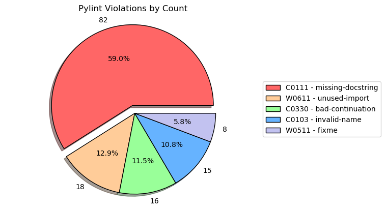

# Pylint Warnings Graph

[](https://github.com/ambv/black)

Small example to take a Pylint report and generage a pie chart
summarising which Pylint warning(s) are most common in your
project.

## Basic Usage

Generate a report for your project:

```shell
pylint <WhateverYourProjectNameIs> -r n --msg-template="{path}:{line}: [{msg_id}({symbol}), {obj}] {msg}" > pylint-report.txt
```

Take `pylint-report.txt` and put it in the same directory as the `Dockerfile` for
this project.

Generate a graph with the supplied `buildgraph.sh` script:

```shell
./buildgraph.sh
```

This will build the Docker image with matplotlib & the other
dependencies installed, create an `output/` directory in your current directory,
and create a `pylint.png` file in that directory that will look something like:


